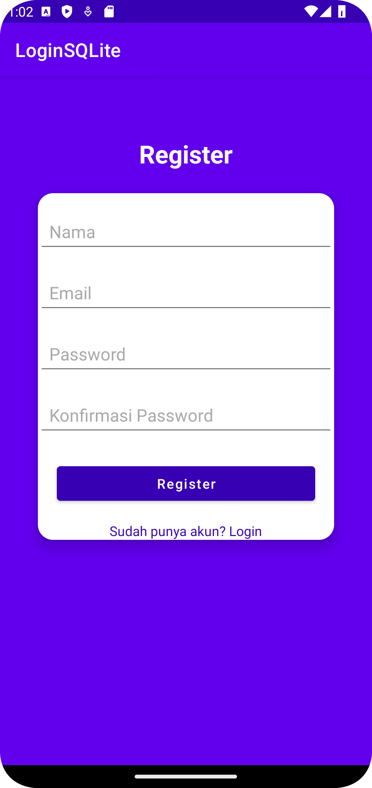
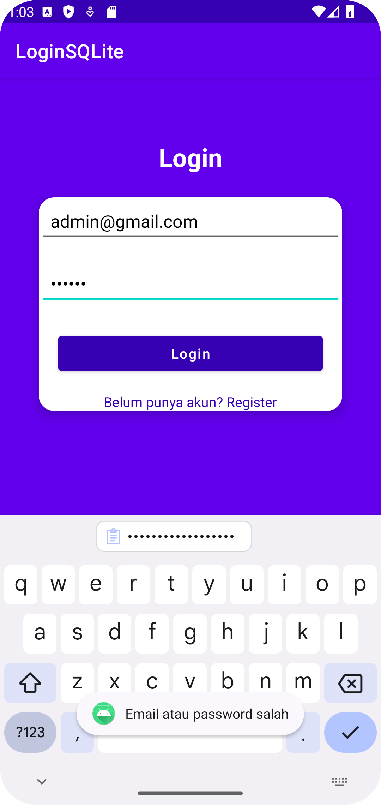
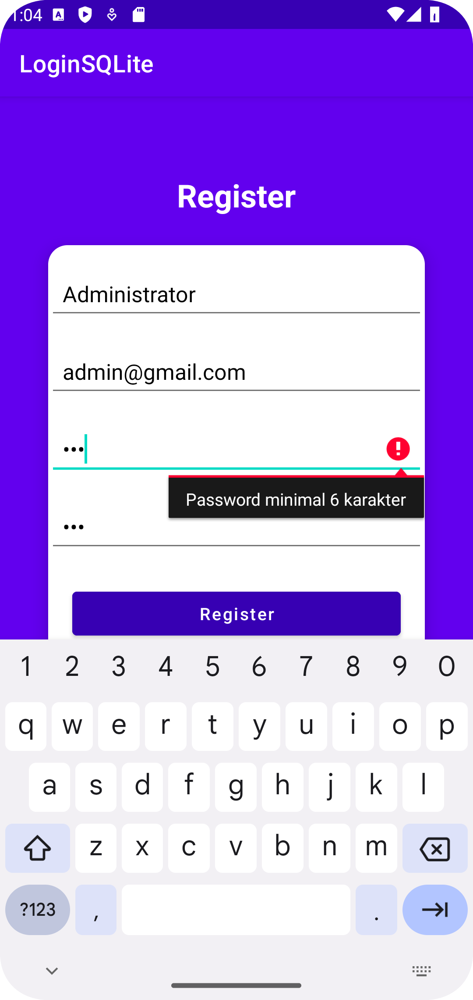
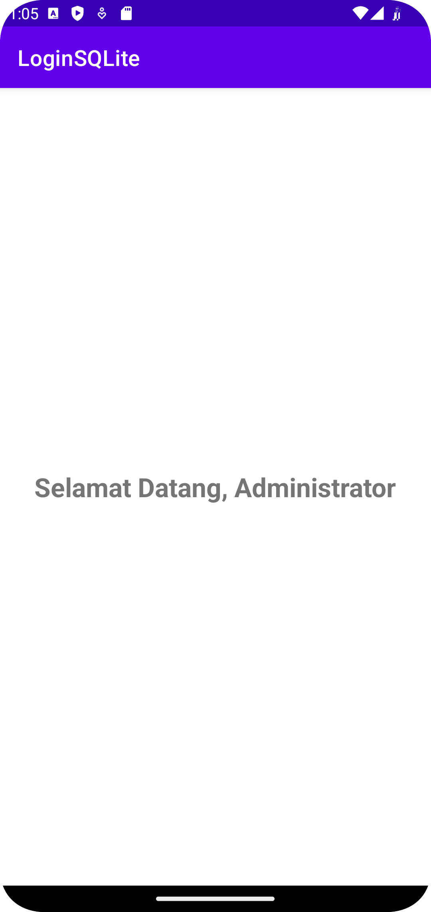

# 📱 Android Login & Register App with SQLite

## Nama   : Salwa Syahratul Aeni
## NIM    : 220220031
## Prodi  : Sistem Informasi

## 🚀 Features

- Register with **Name**, **Email**, **Password**, and **Confirm Password**
- Login using registered **Email** and **Password**
- Input validation:
  - Valid email format
  - Password minimum 6 characters
  - Password and confirmation must match
- Store user data locally using **SQLite**
- Display welcome message with user name after login

---

## 🧭 Alur Aplikasi

1. **Aplikasi Dibuka**
   - Langsung menampilkan halaman Login.

2. **Login**
   - User mengisi Email dan Password
   - Validasi:
     - Format email harus valid
     - Password minimal 6 karakter
   - Jika login sukses:
     - Arahkan ke halaman MainActivity
     - Tampilkan: `Selamat Datang, [Nama User]`
   - Jika gagal:
     - Tampilkan pesan error
   - Tersedia tombol untuk berpindah ke halaman Register

3. **Register**
   - User mengisi:
     - Nama
     - Email
     - Password
     - Konfirmasi Password
   - Validasi:
     - Semua input harus diisi
     - Email harus valid
     - Password dan konfirmasi minimal 6 karakter dan harus cocok
     - Email belum pernah digunakan
   - Jika valid:
     - Simpan data ke SQLite
     - Arahkan ke halaman Login

4. **MainActivity**
   - Menampilkan pesan: `Selamat Datang, [Nama User]`

---

## 🖼️ Tampilan Aplikasi

| Tampilan Login | Tampilan Register |
|----------------|-------------------|
|  |  |

| Validasi Login | Validasi Register |
|----------------|-------------------|
|  |  |

| Berhasil Login |
|----------------|
|  |

---

## 🛠️ Tools & Teknologi

- Java
- XML Layouts
- Android Studio
- SQLite
- Toast & Intent handling

---

## 📦 Cara Menjalankan

1. Clone atau download project ini
2. Buka dengan **Android Studio**
3. Jalankan di emulator atau perangkat fisik
4. Lakukan proses register, lalu login

